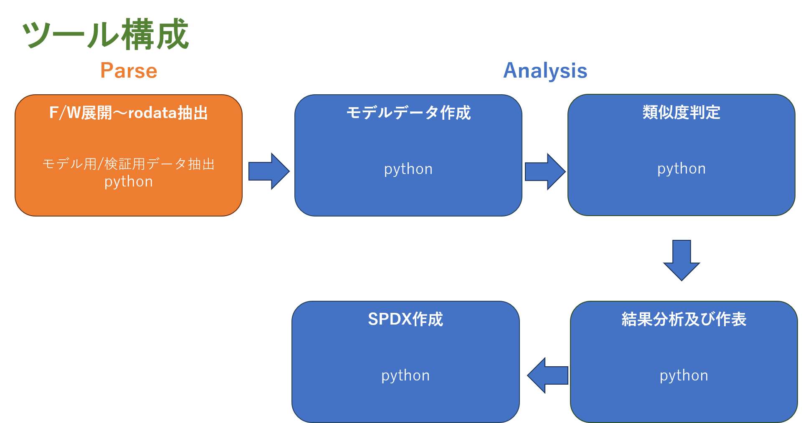
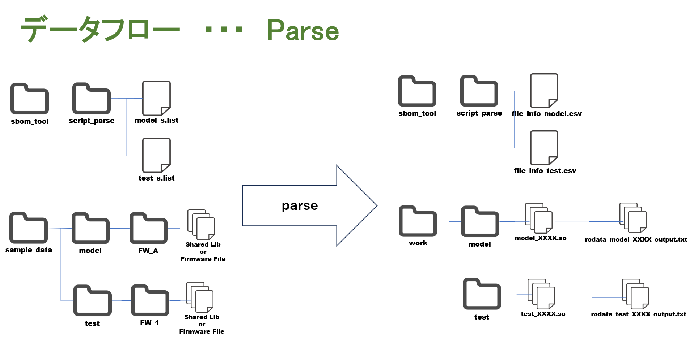
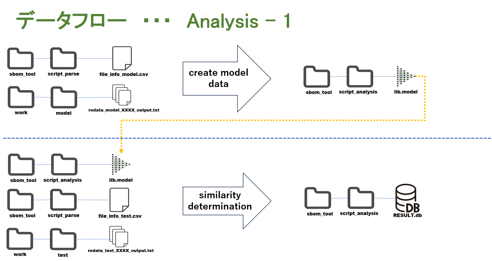
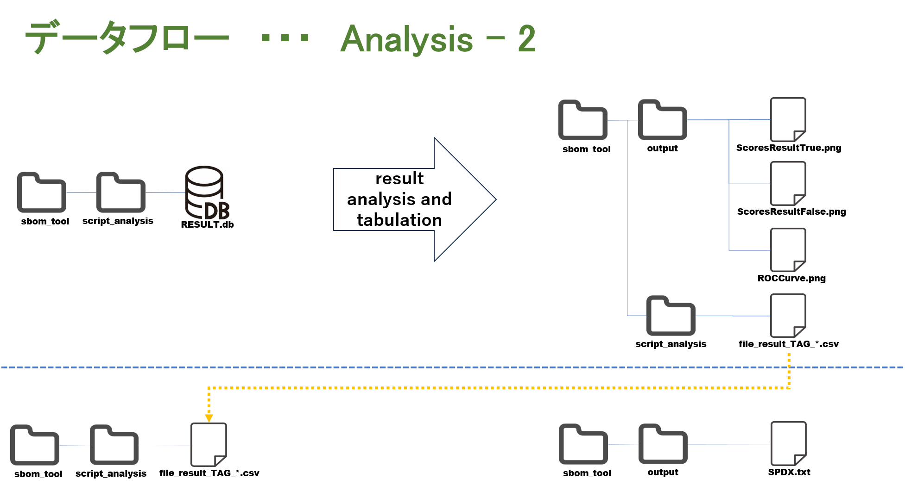

# **NICT SBOM TOOL**

# 概要
## ファームウェアから共有ライブラリの.rodateセクションデータを抽出して、モデル及び検証用のデータの作成を行い、Doc2Vecを用いて類似度を算出し、類似度の情報をＳＰＤＸフォーマットでファイルへ出力する。

# 推奨環境
## ダウンロードしたSRCコードを使用
### OS:         "Ubuntu"  
### VERSION:    "20.04.5 LTS (Focal Fossa)"  

## Dockerイメージを使用する
### Dockerイメージがロード及び実行可能な環境

# インストール
## SRCコードを使用する場合のインストール
- sudo apt install binwalk
- root_sbom_toolフォルダを任意のフォルダにダウンロード
- 必須インストールpythonモジュール  
cycler==0.12.1  
fonttools==4.47.2  
gensim==4.3.2  
importlib-resources==6.1.1  
joblib==1.3.2  
kiwisolver==1.4.5  
matplotlib==3.7.4  
numpy==1.24.4  
packaging==23.2  
pandas==2.0.3  
pillow==10.2.0  
pyparsing==3.1.1  
python-dateutil==2.8.2  
pytz==2023.3.post1  
scikit-learn==1.3.2  
scipy==1.10.1  
six==1.16.0  
smart-open==6.4.0  
threadpoolctl==3.2.0  
tzdata==2023.4  
zipp==3.17.0  

## Dockerイメージを使用する場合のインストール
- docker_imageフォルダのnict_sbom_tool_vXXX.tar.gzを任意のフォルダにダウンロード
- tar -xzf　nict_sbom_tool_vXXX.tar.gz
- docker load < nict_sbom_tool_vXXX.tar
- docker run -it nict_sbom_tool:verXXX
- cd /root/root_sbom_tool　

*　XXXはVERSION番号

# 実行手順
## SAMPLEデータを使用する
### インストール済のSAMPLEデータを使用した実行確認が可能です
1.  cd root_sbom_tool/venv
2.  venv_nict_sbom_tool.tar.gz
3.  source venv_nict_sbom_tool/bin/activate
4.  cd ../sbom_tool/
5.  ./quick_run_all.sh
6.  ./output 以下に結果の表とspdxファイルが出力される

## オリジナルデータを使用する
1.  cd root_sbom_tool/venv
2.  venv_nict_sbom_tool.tar.gzを解凍
3.  source venv_nict_sbom_tool/bin/activate
4.  以降、下記手順を参照

# データフロー

